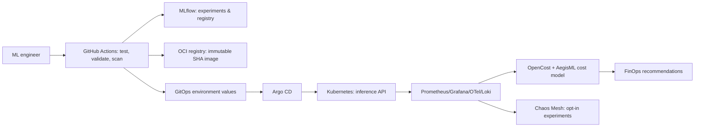

# AegisML — FinOps-Aware ML Inference & Reliability Platform

AegisML is a portable, GitOps-operated platform reference for a real-time transaction-risk inference workload. It intentionally couples the ML lifecycle with the operational questions that matter in production: **is the model safe to promote, is the service meeting its SLO, and what does each prediction cost?**

> This repository contains a runnable local inference service and deployable Kubernetes/GitOps assets. Cost is an **estimate derived from configured unit rates and measured Prometheus/OpenCost inputs**, never cloud-billing data. Chaos manifests target only the `chaos` namespace and require a deliberate apply.

## Architecture



## Quick start

Prerequisites: Python 3.11+, Docker, `kind`, `kubectl`, Helm, and (for the full observability demo) an existing Prometheus/OpenCost installation. The local API has no required external service.

```bash
make setup             # virtualenv and pinned application dependencies
make train             # train deterministic synthetic fraud model + metadata
make validate-model    # promotion gate
make test              # unit and API tests
make run               # http://127.0.0.1:8080/docs
make smoke-test        # exercise health, ready, prediction and cost endpoints
make build IMAGE_TAG=$(git rev-parse --short HEAD)
make setup-cluster     # creates kind cluster and namespaces
make deploy IMAGE_TAG=$(git rev-parse --short HEAD) # Helm (local substitute for Argo reconciliation)
```

`make deploy` is a developer-only local convenience. The CI workflow edits GitOps values; it never applies workload manifests to a cluster. Argo CD owns deployed state in an environment.

## Demo walkthrough

1. **Model promotion:** run `make train && make validate-model`. The gate checks artifact integrity, mandatory metadata, ROC-AUC, and measured prediction latency before marking the build eligible for `development`.
2. **Normal deployment:** publish a SHA-tagged image through CI, review its GitOps values change, and let Argo CD reconcile `gitops/applications/inference-dev.yaml`.
3. **Traffic/autoscaling:** deploy Prometheus Adapter/KEDA as documented, then run `scripts/generate-traffic.sh`; HPA uses CPU plus request-rate external metric. KEDA is supplied as an optional HTTP add-on when the metric adapter exists.
4. **FinOps:** query `/cost` locally for an explicit estimate or use the Grafana dashboard against OpenCost. Run `make finops` to produce data-labelled recommendations.
5. **Controlled chaos:** only in a disposable cluster, run `make chaos`. Keep traffic running and compare the Prometheus/Grafana SLO, p95, replicas, and OpenCost panels before/during/after. The report template records actual measured values; it contains no fabricated results.

## API

| Endpoint | Purpose |
|---|---|
| `GET /health`, `GET /ready` | process and model readiness |
| `GET /metrics` | Prometheus metrics |
| `POST /predict` | idempotent transaction-risk inference |
| `GET /model`, `GET /version` | active model provenance |
| `GET /cost` | transparent estimated cost-per-inference |
| `GET /reliability` | in-process SLO/error-budget snapshot |

See [deployment](docs/deployment.md), [MLOps](docs/mlops.md), [FinOps](docs/finops.md), [chaos engineering](docs/chaos-engineering.md), and [production readiness](docs/production-readiness.md).

## Local vs. production

The service uses a local joblib artifact by default. In a cluster, MLflow artifacts may be backed by MinIO/S3 and the tracking server by PostgreSQL. OpenCost supplies cluster allocation data; the API's local cost calculator is a documented substitute for laptop demos. Cloud mappings for EKS/AKS/GKE are in [architecture](docs/architecture.md).

## Safety and scope

Never apply chaos manifests to production. Use separate service accounts, an explicitly selected target namespace, approval records, and a bounded selector. Image tags are immutable; `latest` is denied by policy. See [security](docs/security.md).
