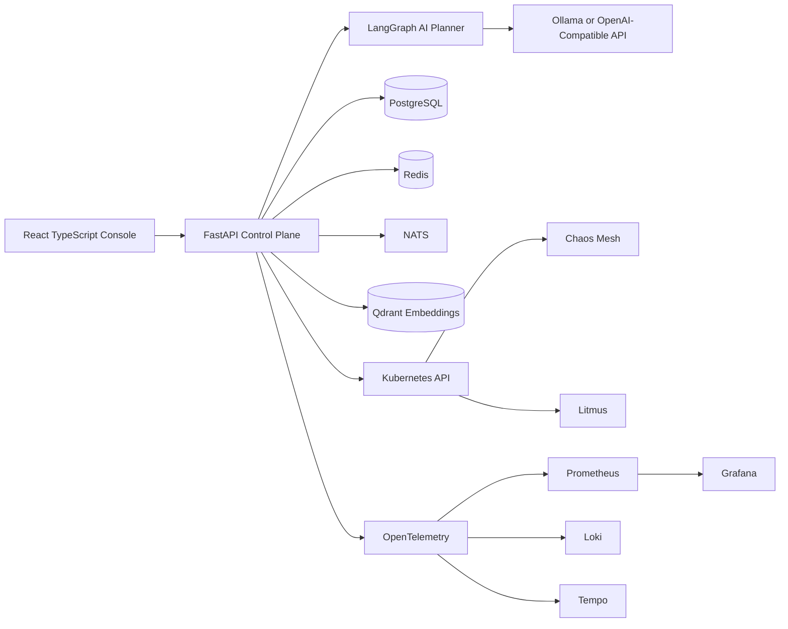

# Architecture

```mermaid
flowchart LR
  UI[React TypeScript Console] --> API[FastAPI Control Plane]
  API --> Planner[LangGraph AI Planner]
  Planner --> Ollama[Ollama or OpenAI-Compatible API]
  API --> PG[(PostgreSQL)]
  API --> Redis[(Redis)]
  API --> NATS[NATS]
  API --> Qdrant[(Qdrant Embeddings)]
  API --> K8s[Kubernetes API]
  K8s --> ChaosMesh[Chaos Mesh]
  K8s --> Litmus[Litmus]
  API --> OTel[OpenTelemetry]
  OTel --> Prometheus
  OTel --> Loki
  OTel --> Tempo
  Prometheus --> Grafana
```

The control plane never executes destructive experiments without a persisted approval decision and blast-radius policy.
